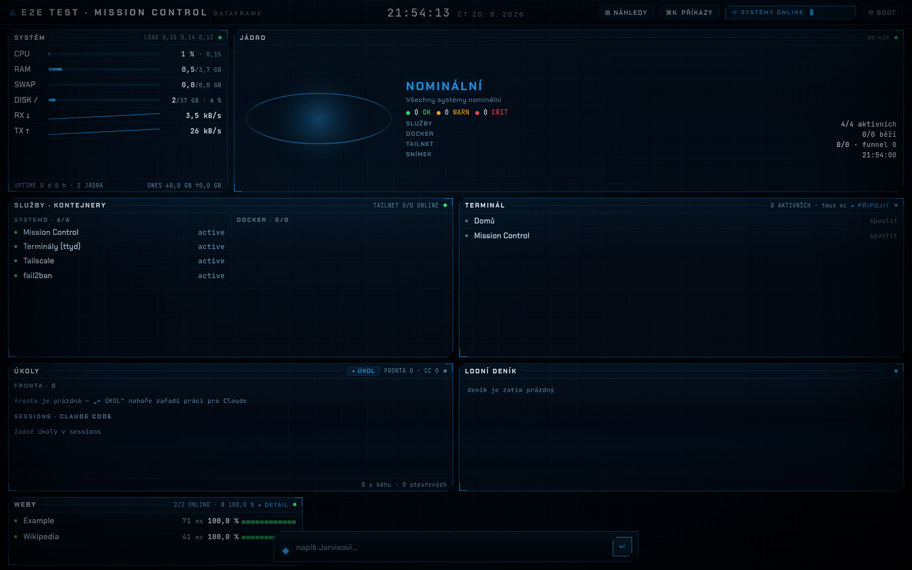

# Mission Control

**Jarvis-style HUD pro tvůj vlastní server.** Jedna stránka v prohlížeči, na
které vidíš, jak se stroji daří — RAM, disk, load, síť, služby, výstrahy —
a ve které zároveň **žijí terminály s Claude Code**: perzistentní sessions
v tmuxu, které přežijí zavření tabu, plus servisní chat („Jarvis") přímo
v hlavičce. K tomu volitelné moduly pro věci, které tě na tvých projektech
zajímají: dostupnost webů, návštěvnost, indexace v Googlu, naplánované posty,
limity Claude účtu, osobní asistent NanoClaw a hodinový hlídač cronů, který
píše český deník toho, co se na serveru dělo.

Zero-dependency Node (žádný `node_modules`), česky, MIT.



## Rychlý start

```bash
git clone https://github.com/konecny-lukas/mission-control.git ~/mission-control
```

Pak řekni svému Claude Code: **„nainstaluj Mission Control podle
`~/mission-control/INSTALL.md`"**.

[`INSTALL.md`](INSTALL.md) je psaný pro Claude — provede ho fázemi 0–6 (server,
prerekvizity, HUD, přihlášení, volitelné moduly, zpřístupnění), doptá se tě na
to, co za tebe nemá hádat, a po každé fázi si sám ověří výsledek. Na konci
dostaneš URL, na které HUD běží.

Nemáš ještě server? Fáze 0 ti ho založí na Hetzneru přes API
(`install/provision-hetzner.sh`, doporučeno CX33 — 4 vCPU / 8 GB, ~8,50 €/měs.).

## Architektura

- **Jádro** — `server.js` + `collectors.js` + `stream.js`: HTTP server (jen
  `127.0.0.1`), telemetrie ze systému a SSE push do prohlížeče. Žádné externí
  závislosti, jen vestavěný Node (`node:sqlite` — proto Node ≥ 22.5).
- **HUD** — `public/`: WebGL jádro, dataframe panely, drawery, timeline,
  příkazová paleta. Statické soubory, žádný build krok.
- **Terminály** — `tmux` na vyhrazeném socketu `-L mc` + `ttyd` na loopbacku,
  reverzně proxovaný serverem (sdílí origin včetně WebSocketů). Session
  `mc-<projekt>-<číslo>` běží dál, i když zavřeš prohlížeč; jména jsou
  perzistentní v `data/term-labels.json`.
- **Agenti** — Jarvis (servisní chat), diagnostická vlákna nad výstrahami
  a hodinový hlídač cronů jedou přes lokálně přihlášené **Claude Code CLI**.
  Žádný API klíč: jedno přihlášení, které si nastavíš při instalaci.
- **Konfigurace** — jediný `mc.config.json` (v gitu jen `.example`) plus
  volitelné env overridy v `mc.env`. **Modul je zapnutý právě tehdy, když má
  v configu svou sekci** — jinak se jeho kolektor nespustí a panel se
  nevykreslí.

## Moduly

| Modul | Sekce v `mc.config.json` | Co dělá | Co potřebuje |
|---|---|---|---|
| **uptime** | `modules.uptime.sites[]` | minutové HTTP sondy webů, historie dostupnosti a odezvy, per-web statistiky | jen URL |
| **ga4** | `modules.ga4.sites[]` | denní sessions/uživatelé/zobrazení z Google Analytics 4 + realtime, s ověřením hostname property | Google service account, číselné property ID |
| **gsc** | `modules.gsc.sites[]` | denní kliky, imprese, CTR a pozice ze Search Console + top dotazy | týž service account, property |
| **indexace** | `modules.indexace.sites[]` | stav indexace URL ze sitemap přes URL Inspection API (1×/24 h, drawer s neindexovanými) | týž service account, sitemap |
| **claudelimits** | `modules.claudelimits` | vytížení limitů Claude předplatného | nic (čte lokální `~/.claude`, read-only) |
| **wpsched** | `modules.wpsched.sites[]` | naplánované WordPress posty přes REST API, upozornění na zaseknuté | application password (výhradně GET) |
| **nanoclaw** | `modules.nanoclaw.dir` | read-only panel nad instalací [NanoClaw](https://github.com/nanocoai/nanoclaw): stav služby, agenti, poslední aktivita | běžící NanoClaw na stejném boxu |
| **watchdog** | `modules.watchdog.projects[]` | hodinový hlídač cronů: headless Claude zkontroluje služby a logy, provede bezpečné opravy a napíše český narativ do timeline | crontab řádek (skill `novy-cron`) |

Balíček navíc přináší vrstvu pro Claude (`claude/`): skilly `novy-cron`
(opakovaná úloha = skutečný crontab záznam s důkazem) a `mc-restore-terminals`
(obnova sessions po pádu tmuxu) plus šablonu `CLAUDE.md`, díky které Claude na
tomhle boxu ví, že výstupy se ukazují přes `mc-open`/`mc-preview` a že „hotovo"
znamená ověřeno.

## Bezpečnostní model

- **Server poslouchá jen na `127.0.0.1`.** Nikdy ne `0.0.0.0`.
- **Expozice je tvoje vědomá volba** (fáze 5 instalace): doporučený Tailscale
  serve (tailnet-only), SSH tunel, nebo reverzní proxy s basic auth —
  s varováním, co to znamená. Mission Control **nemá vlastní přihlašování**.
- **Terminály a Jarvis = plná důvěra.** Kdo se dostane do HUD, má shell
  s Claude Code na tvém serveru. Bezpečnostní hranice je vrstva před MC
  (tailnet, proxy s heslem), ne aplikace sama.
- **Tajemství mimo git.** `mc.config.json`, `mc.env`, `secrets/` i `data/` jsou
  v `.gitignore`; v repu jsou jen `.example` soubory bez reálných hodnot.
  Do configu se píše **cesta** ke klíči, nikdy jeho obsah.
- **Akční allowlist.** Stavové endpointy (restart služby, spuštění jobu) umí
  jen předem vyjmenované cíle a spouštějí se `execFile` s pevným argv — žádný
  uživatelský vstup se nikdy nedostane do shellu.
- **Hlídač má výchozí režim `safe`.** Běží bez `--dangerously-skip-permissions`,
  s úzkým seznamem nástrojů — protože čte logy, do kterých může psát i někdo
  cizí. Plný režim (`permissionMode: "full"`) je vědomý opt-in.
- **Moduly jsou read-only.** `wpsched` posílá výhradně GET, `nanoclaw` čte
  SQLite v read-only režimu, `claudelimits` nikdy nesahá na refresh token.
- **Žádná telemetrie ven.** Data odcházejí jen tam, kam si sám nakonfiguruješ
  moduly (Google API, tvůj WordPress).

## Roadmap

Ve v1 záměrně nejsou, ale dávají smysl jako další moduly:

- **Ahrefs Web Analytics** — reálná návštěvnost bez cookie lišty,
- **API spend tracker** — kolik stojí placená API napříč projekty,
- **provider credits** — zbývající kredity účtů (Anthropic, Google, …),
- **anglická dokumentace** — `INSTALL.md`/`README.md` v EN.

## Požadavky

Ubuntu 24.04 LTS nebo Debian 12 · Node ≥ 22.5 · `tmux`, `ttyd`, `git`, `jq`,
`python3` · Claude Code CLI · doporučeno 4 vCPU / 8 GB RAM.

## Licence

MIT — viz [LICENSE](LICENSE).
